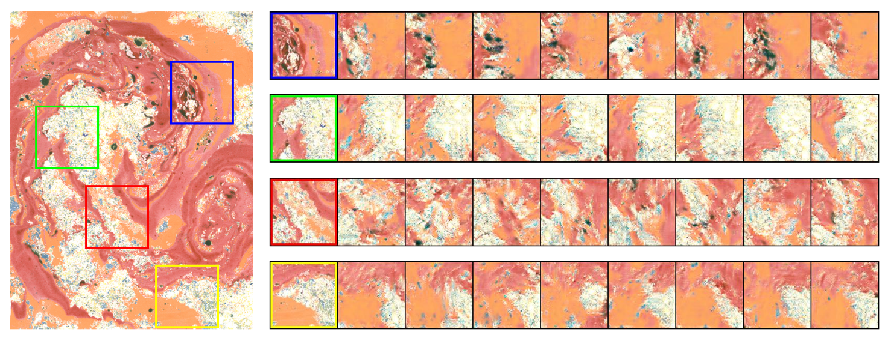
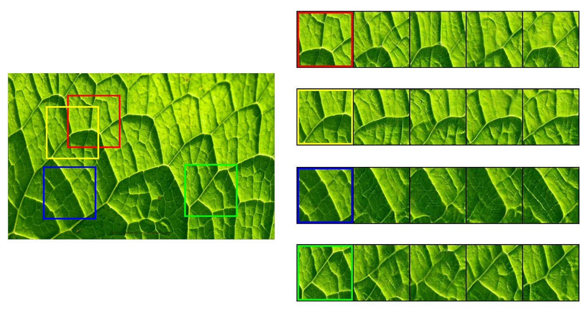
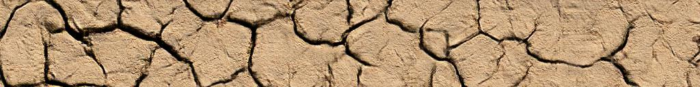
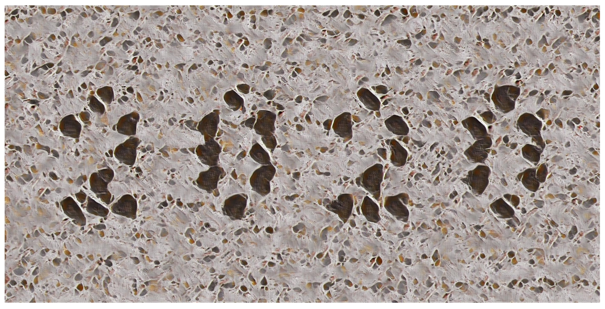

# Co-occurrence Based Texture Synthesis
- Official PyTorch implementation of the paper <a href="https://arxiv.org/abs/2005.08186" target="_blank">Co-occurrence Based Texture Synthesis</a>.  

## Abstract
We model local texture patterns using the co-occurrence
statistics of pixel values. We then train a generative adversarial network,
conditioned on co-occurrence statistics, to synthesize new textures from
the co-occurrence statistics and a random noise seed. Co-occurrences
have long been used to measure similarity between textures. That is,
two textures are considered similar if their corresponding co-occurrence
matrices are similar. By the same token, we show that multiple textures
generated from the same co-occurrence matrix are similar to each other.
This gives rise to a new texture synthesis algorithm.

We show that co-occurrences offer a stable, intuitive and interpretable
latent representation for texture synthesis. Our technique can be used to
generate a smooth texture morph between two textures, by interpolating
between their corresponding co-occurrence matrices. We further show an
interactive texture tool that allows a user to adjust local characteristics
of the synthesized texture image using the co-occurrence values directly.

## Fidelity and Diversity



## Interpolation
> Naive interpolation in RGB space


> Interpolation in the co-occurrence space



## Large image generation with control



## Pre-requisites
- Python 3.7
- PyTorch (conda version recommended, pytorch-gpu = 1.3.1)
- torchvision, numpy, scipy, matplotlib, tqdm, pillow, os, scikit-learn

> In order to install all the requirements via conda, just run the following command:
```bash
conda create -n cooc_texture python=3.7 pytorch-gpu=1.3.1 torchvision numpy scipy matplotlib tqdm pillow=6.1 scikit-learn
```

> and then activate the environment:
```bash
conda activate cooc_texture
```

## Training
Run the following command for training:
```bash
python train_model.py --texturePath=samples/marbled_0095.jpg --imageSize=128 --kVal=8 
```
> Takes around 7 hours on a NVIDIA Tesla V100 GPU, for an image crop size of 128x128 and kVal=8.
- Here, kVal is the number of cluster centers for co-occurrence calculation.
- You can use any image you want, and give the path in the format shown above.

## Evaluating
```bash
python evaluate_model.py --texturePath=samples/marbled_0095.jpg --modelPath=results/marbled_0095_2020-03-02_23-02-09/ --checkpointNumber=120 --kVal=8 --outputFolder=eval_results/marbled_0095/ --evalFunc=f_d  
```
> Replace the modelPath with the actual path of the directory. The one included is just for representation purposes
- `modelPath` is the folder containing the checkpoint models.
- `checkpointNumber` is the number of the epoch of which model we want to use.
- `outputFolder` is the location where we want to save the evaluated results.
- `evalFunc` is the selector between: 
    - `f_d` = Fidelity and Diversity - saves an image showing the fidelity with respect to the input crop, and diversity with respect to random noise vector seeds. 
    - `interp` = Interpolation - saves an image of the interpolation between two crops, by interpolating in the co-occurrence space and then generating the result.
    - `write_tex` = Large Image Generation with Control - saves a high resolution image generated from the input co-occurrence and writes the text '2020' on it.

Check config.py for all options

## Acknowledgements
:tada: Thank you for Zalando SE, for providing for the [**code**](https://github.com/zalandoresearch/famos) which served as a base for this project.

:+1: The Describable Textures Dataset [(DTD)](https://www.robots.ox.ac.uk/~vgg/data/dtd/) for providing with a highly diverse dataset of images.
## License
This project is licensed under the terms of the MIT license (see `LICENSE` for details).

